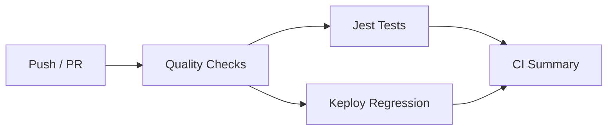

# MedConnect India — Complete Technical Analysis


---

## 1. Executive Summary

### Project Name
**MedConnect India** (`@medconnect` monorepo)

### Purpose
AI-powered Personal Health Record (PHR) platform tailored for the Indian healthcare ecosystem. Allows individuals to securely aggregate, understand, and share their medical records — from prescriptions and lab reports to discharge summaries and imaging.

### Business Problem Solved
Indian healthcare is characterized by **fragmented, paper-based medical records**. Patients visit multiple doctors across different hospitals, manually maintain physical files (or disjointed phone photos), and have no unified digital view of their health history. Doctors lack context during consultations. Family caregivers have no easy way to stay informed.

MedConnect solves this by:
1. Converting document photos/scans into structured, searchable medical data via AI OCR
2. Building a unified chronological health timeline from extracted data
3. Generating AI-powered clinical and patient-facing summaries
4. Enabling secure sharing with family members and healthcare providers
5. Providing conversational voice access to health information in English and Hindi

### Target Users
- Individual patients managing their own health records
- Family caregivers managing records of elderly parents or children
- Healthcare providers accessing summarized patient history
- Indian users comfortable with English and/or Hindi

### Current Maturity
**Alpha/MVP.** Core features are implemented and functional:
- Document OCR pipeline works end-to-end
- AI extraction, timeline generation, and summarization are operational
- Voice assistant works with both English and Hindi
- Family sharing and secure links are functioning
- Authentication, onboarding, and patient switching work

Not yet production-hardened:
- Some AI model names in the fallback chain are speculative
- Voice STT/TTS depends on Gnani AI which has India-only availability
- No comprehensive test coverage for the frontend
- Keploy test suites need to be recorded (CI pipeline has the scaffolding but requires initial test recording)

### Overall Architecture
**Monorepo with Turborepo + pnpm workspaces.** Three primary packages:
- **Frontend:** Next.js 15 App Router (React 19) with Tailwind CSS + shadcn/ui
- **Backend:** NestJS 11 (Node.js) with Prisma ORM, BullMQ queues, multi-model AI
- **Database:** PostgreSQL 16 with pgvector extension

Secondary shared packages:
- `@medconnect/shared-types` — TypeScript interfaces shared between FE/BE
- `@medconnect/fhir-parser` — FHIR resource parsing utilities

### High-Level Workflow

```
User Uploads Document → Supabase Storage → OCR (Doc AI / Gemini fallback)
    → Structured Extraction (Gemini + Patient Context)
    → Database Storage → Timeline Generation (Fire-and-forget)
    → Medication/Lab Auto-creation → AI Summary Generation
```

```
User Voice Query → Gnani STT → Gemini AI Processing → Gnani TTS → Audio Response
```

---

## 2. Tech Stack

### Frontend

| Technology | Version | Purpose | Why |
|---|---|---|---|
| **Next.js** | 15 (App Router) | React framework | Server components, streaming, file-based routing, server actions, middleware |
| **TypeScript** | 5.7 | Type safety | Strict mode across entire codebase |
| **Tailwind CSS** | 3.4 | Styling | Utility-first; paired with `tailwindcss-animate` and `@tailwindcss/typography` |
| **shadcn/ui** | — | Component system | Radix UI primitives with custom `cn()` styling via `class-variance-authority` |
| **TanStack React Query** | 5 | Server state | 5-min stale time, 30-min GC, auto-refetch for processing statuses |
| **Clerk** | 6.10 (Next.js SDK) | Authentication | Social login (Google), email/password, passkeys, 2FA (TOTP) |
| **Framer Motion** | 12 | Animation | Spring animations, page transitions, micro-interactions |
| **Recharts** | 2 | Charts | Lab result trend lines, biomarker visualization |
| **React Hook Form** | 7.54 | Forms | Validation with `@hookform/resolvers` |
| **Zod** | 3.24 | Schema validation | Shared validation schemas |
| **Sonner** | 1.7 | Toast notifications | Rich-colored, positioned top-right, auto-dismiss |
| **Lucide React** | 0.468 | Icons | Consistent icon set |
| **date-fns** | 4 | Date formatting | Locale-aware formatting (`en-IN`) |
| **next-themes** | 0.4 | Theme management | Dark/light/system mode with hydration guard |
| **qrcode.react** | 4.2 | QR codes | Share link QR generation |
| **clsx** + **tailwind-merge** | — | Class merging | `cn()` utility |

### Backend

| Technology | Version | Purpose | Why |
|---|---|---|---|
| **NestJS** | 11 | Node.js framework | Decorator-based modular architecture, DI, guards, interceptors, pipes |
| **TypeScript** | 5.7 | Type safety | Strict mode |
| **Prisma** | 6.1 | ORM | Type-safe DB access, migrations, pgvector support |
| **PostgreSQL** | 16 (pgvector) | Database | pg_trgm for fuzzy search, vector for embeddings |
| **Redis** | 7 | Queue + Cache | BullMQ backing store, ephemeral data caching |
| **BullMQ** | 5 | Job queue | Background OCR, AI summarization, context sync |
| **Google Gemini** | `@google/generative-ai` 0.24 | Multi-modal AI | OCR fallback, extraction, timeline gen, summarization, chat |
| **Google Document AI** | 9.6 | Production OCR | Primary document text extraction |
| **Supabase JS** | 2.110 | Object storage | File uploads, signed URLs, CDN |
| **Clerk Backend** | 3.11 | JWT verification | JWKS-based token verification |
| **Mem0** | 3.1 | AI memory | Long-term patient context storage |
| **Alchemyst AI** | — | Context provider | Alternative fallback for patient context |
| **Gnani AI** | — | Indian voice AI | STT/TTS for English + 9 Indian languages |
| **Swagger** | NestJS plugin | API docs | Auto-generated OpenAPI spec |
| **Helmet** | 8 | Security headers | CSP, XSS, frame-options |
| **class-validator** + **class-transformer** | 0.14 / 0.5 | DTO validation | Whitelist, forbid non-whitelisted |
| **Passport** | 0.7 | Auth strategies | Clerk JWT strategy via passport-jwt |
| **ioredis** | 5.4 | Redis client | BullMQ connection |
| **multer** | 1.4.5 | File uploads | Multipart form parsing |
| **uuid** | 11 | ID generation | Entity IDs, tokens |
| **dayjs** | 1.11 | Date handling | Lightweight date manipulation |

### Infrastructure & Tooling

| Technology | Version | Purpose |
|---|---|---|
| **Turborepo** | 2.3 | Monorepo build orchestration with caching |
| **pnpm** | 10.27 | Package manager (workspaces, frozen lockfile) |
| **Docker** | — | Containerized dev environment (PostgreSQL + Redis) |
| **Keploy** | latest | API test generation from traffic recording |
| **Jest** | 29 | Unit testing (backend only) |
| **ESLint** | 9 | Linting (typescript-eslint, next) |
| **Prettier** | 3.4 | Code formatting |
| **Vercel** | — | Frontend deployment (Next.js) |

---

## 3. Folder Structure

```
medconnect-india/
│
├── frontend/                         # Next.js 15 frontend application
│   ├── src/
│   │   ├── app/
│   │   │   ├── (auth)/               # Auth routes group (no sidebar)
│   │   │   │   ├── sign-in/          # Clerk SignIn page
│   │   │   │   ├── sign-up/          # Clerk SignUp page
│   │   │   │   └── layout.tsx        # Auth layout (branding, trust badges)
│   │   │   ├── (dashboard)/          # Dashboard routes group (with sidebar)
│   │   │   │   ├── dashboard/        # Main dashboard with stats, AI insights
│   │   │   │   ├── timeline/         # Health timeline page
│   │   │   │   ├── documents/        # Document list + single doc view
│   │   │   │   ├── medications/      # Medication tracking
│   │   │   │   ├── labs/             # Lab results with trends
│   │   │   │   ├── doctor-summary/   # AI-generated clinical summary
│   │   │   │   ├── family/           # Family group management
│   │   │   │   ├── share/            # Secure share link management
│   │   │   │   ├── search/           # Cross-entity search
│   │   │   │   ├── settings/         # User settings (2FA, profile)
│   │   │   │   ├── layout.tsx        # Dashboard shell (sidebar + header)
│   │   │   │   └── template.tsx      # Page transition wrapper
│   │   │   ├── onboarding/           # Post-signup onboarding flow
│   │   │   ├── public/share/[token]/ # Public shared record view
│   │   │   ├── layout.tsx            # Root layout (Outfit font, providers)
│   │   │   ├── page.tsx              # Entry point (auth redirect)
│   │   │   └── globals.css           # CSS variables, glass effects, Clerk overrides
│   │   ├── components/
│   │   │   ├── ui/                   # shadcn/ui primitives (card, button, badge, etc.)
│   │   │   ├── auth/                 # Google auth button
│   │   │   ├── documents/            # Document uploader (drag & drop)
│   │   │   ├── premium/              # Premium widgets (health score, emergency card, etc.)
│   │   │   ├── voice/                # Voice recorder, player, assistant
│   │   │   ├── patient-switcher.tsx  # Switch between own/family records
│   │   │   ├── patient-context.tsx   # React context for "viewing as" patient
│   │   │   ├── mode-toggle.tsx       # Dark/light toggle
│   │   │   ├── theme-provider.tsx    # next-themes wrapper
│   │   │   └── error-boundary.tsx    # React error boundary
│   │   ├── hooks/                    # Custom React hooks
│   │   │   ├── use-dashboard.ts      # Dashboard stats + AI summary queries
│   │   │   ├── useVoice.ts           # Voice recording, STT, TTS state machine
│   │   │   ├── use-labs.ts           # Lab results queries/mutations
│   │   │   ├── use-medications.ts    # Medication queries/mutations
│   │   │   ├── use-sharing.ts        # Share link mutations
│   │   │   ├── use-family.ts         # Family group queries/mutations
│   │   │   ├── use-search.ts         # Search query
│   │   │   ├── use-timeline.ts       # Timeline queries
│   │   │   ├── use-documents.ts      # Document queries/mutations
│   │   │   └── use-summary.ts        # Summary queries
│   │   ├── lib/
│   │   │   ├── api-client.ts         # Full API client (all endpoints, typed)
│   │   │   └── utils.ts             # cn(), formatDate(), formatDateTime()
│   │   ├── providers/
│   │   │   ├── index.tsx             # Clerk + React Query + Theme + Sonner
│   │   │   └── token-provider.tsx    # Injects Clerk token into API client
│   │   └── services/
│   │       └── voice.api.ts          # Voice API bindings (STT, TTS, chat)
│   ├── middleware.ts                 # Clerk route protection
│   ├── next.config.ts                # Image remote patterns, server actions
│   ├── tailwind.config.ts            # Theme colors, animations
│   └── vercel.json                   # Next.js framework preset
│
├── backend/                          # NestJS 11 backend API
│   ├── src/
│   │   ├── main.ts                   # Bootstrap (Swagger, CORS, Helmet, pipes, filters)
│   │   ├── app.module.ts             # Root module (imports 17 feature modules)
│   │   ├── common/
│   │   │   ├── decorators/           # @CurrentUser(), @Public(), @Roles()
│   │   │   ├── dto/                  # PaginationDto, ApiResponseDto
│   │   │   ├── filters/             # AllExceptionsFilter (global error handler)
│   │   │   ├── guards/              # ClerkAuthGuard (JWT via JWKS)
│   │   │   └── interceptors/        # TransformInterceptor ({ data: ... })
│   │   └── modules/
│   │       ├── ai/                  # GeminiService (multi-model fallback)
│   │       ├── ai-context/          # Context aggregation (Mem0, Alchemyst)
│   │       │   ├── providers/       # Mem0ContextProvider, AlchemystContextProvider
│   │       │   └── dto/             # MedicalContext interfaces
│   │       ├── auth/                # Clerk strategy, user sync, onboarding
│   │       ├── dashboard/           # Dashboard stats + health score
│   │       ├── database/            # PrismaService + PrismaModule
│   │       ├── documents/           # Document CRUD, upload, download, process
│   │       ├── family/              # Family groups, invitations, permissions
│   │       ├── fhir/                # FHIR export (Bundle generation)
│   │       ├── health/              # Health check endpoint
│   │       ├── labs/                # Lab results CRUD
│   │       ├── medications/         # Medication CRUD + reminders
│   │       ├── memory/              # Mem0 provider, cache, sanitizer, sync
│   │       ├── ocr/                 # Google Doc AI → Gemini fallback pipeline
│   │       ├── search/              # Full-text search (pg_trgm)
│   │       ├── sharing/             # Share links, access logs, public view
│   │       ├── storage/             # Supabase Storage abstraction layer
│   │       ├── summary/             # Doctor/patient AI summaries
│   │       ├── timeline/            # Timeline events, AI generation, AI summary
│   │       └── voice/               # STT, TTS, conversational AI via Gnani
│   ├── test/                        # E2E tests (Jest + supertest)
│   ├── docker-compose.yml           # PostgreSQL 16 + Redis 7 + API
│   └── Dockerfile                   # Multi-stage production build
│
├── database/                         # Database layer
│   ├── prisma/
│   │   ├── schema.prisma            # 21 models, 15 enums
│   │   └── migrations/              # Prisma migrations
│   └── src/index.ts                 # Re-exports Prisma client
│
├── packages/
│   ├── shared-types/                 # TypeScript interfaces shared FE↔BE
│   └── fhir-parser/                  # FHIR resource parsing utilities
│
├── docs/
│   └── keploy.md                    # Keploy integration guide
│
├── scripts/
│   └── keploy-setup.sh              # Keploy CLI install script
│
├── .github/workflows/
│   └── keploy-ci.yml                # CI pipeline (3 jobs)
│
├── turbo.json                        # Turborepo pipeline config
├── pnpm-workspace.yaml               # pnpm workspace definition
├── keploy.yml                        # Keplay test config
├── .nvmrc                           # Node 22.14.0
├── .prettierrc                      # Prettier config
└── package.json                     # Root scripts
```

---

## 4. Application Architecture

### Architecture Style
**Modular monolith** exposed as a REST API with a separate Next.js frontend. The backend follows the NestJS module pattern — each domain (documents, medications, timeline, etc.) is a self-contained module with its own controller, service, DTOs, and optionally its own database query layer.

### Layer Separation

```
┌────────────────────────────────────────────────────┐
│                    Frontend (Next.js 15)           │
│  Pages → Components → Hooks → API Client → Fetch   │
└────────────────────────────────────────────────────┘
                         │ HTTP REST
                         ▼
┌────────────────────────────────────────────────────┐
│              Backend (NestJS 11)                   │
│                                                     │
│  Guards (ClerkAuth, Throttler)                      │
│      │                                              │
│  Interceptors (TransformInterceptor)                │
│      │                                              │
│  Controllers (route handlers, DTO validation)       │
│      │                                              │
│  Services (business logic, external API calls)       │
│      │                                              │
│  PrismaService (database)                           │
│      │                                              │
│  Background: BullMQ Queues (OCR, AI, Context Sync)  │
└────────────────────────────────────────────────────┘
                         │
                         ▼
┌────────────────────────────────────────────────────┐
│              Data Layer                             │
│  PostgreSQL 16 (pgvector)  │  Redis 7  │  Supabase  │
└────────────────────────────────────────────────────┘
```

### Request Flow

```
Browser → Clerk Middleware (verify session)
    → Next.js Page (RSC or Client Component)
    → React Query request
    → fetch() with Clerk JWT (Bearer token)
    → NestJS Global Guards:
        1. ThrottlerGuard (10 req/s, 100 req/min)
        2. ClerkAuthGuard (verify JWT via JWKS, extract user)
    → TransformInterceptor (wraps response in { data: ... })
    → Controller (validates DTO via ValidationPipe)
    → Service (business logic)
    → PrismaService (database query) OR BullMQ (background job)
    → Response back through interceptor
```

### Error Handling Flow

```
Service throws NestJS HttpException
    → AllExceptionsFilter catches it
    → Logs error (stack trace in dev, message only in prod)
    → Returns { success: false, error: { message, statusCode, timestamp, path } }
```

Validation errors from `ValidationPipe` return 400 with array of error messages.

### Configuration Management

**NestJS ConfigModule** (global) loads from `.env` / `.env.local`:

```typescript
ConfigModule.forRoot({
  isGlobal: true,
  envFilePath: [".env", ".env.local"],
});
```

All environment variables documented in `backend/.env.example` (22 variables).

---

## 5. Frontend Analysis

### Framework
Next.js 15 App Router with:
- **Server Components** by default (pages are server components unless marked `"use client"`)
- **Client Components** for interactive pages (dashboard, documents, etc.)
- **Middleware** for Clerk route protection
- **Server Actions** for document upload (10 MB limit)

### Routing
```
/                            → Redirect to /dashboard or /sign-in
/sign-in                     → Clerk SignIn
/sign-up                     → Clerk SignUp
/onboarding                  → Post-auth profile setup
/dashboard                   → Main dashboard
/timeline                    → Health timeline
/documents                   → Document list
/documents/[id]              → Document detail
/medications                 → Medication list
/labs                        → Lab results
/doctor-summary              → AI summary
/family                      → Family groups
/share                       → Share links
/search?q=                   → Search results
/settings                    → User settings
/public/share/[token]        → Public shared record view (no auth)
```

### Layout System
- **Root layout** (`layout.tsx`): Outfit font, Providers wrapper
- **Auth layout** (`(auth)/layout.tsx`): Clean auth card with brand, Clerk integration, trust badges
- **Dashboard layout** (`(dashboard)/layout.tsx`): Full sidebar + header + main content area
- **Dashboard template** (`template.tsx`): Page transition wrapper (Framer Motion)

### Component Hierarchy
```
RootLayout
└── Providers (Clerk + React Query + Theme + Sonner)
    └── AuthLayout (sign-in/sign-up pages)
    └── DashboardLayout (authenticated pages)
        ├── Sidebar (brand, navigation, user profile, badge counts)
        ├── Header (search, patient switcher, theme toggle, notifications)
        ├── Main Content (page component)
        ├── VoiceAssistant (global FAB, bottom-right)
        ├── QuickActions (global FAB, bottom-left)
        └── PageTransition (wrapper from template.tsx)
```

### Reusable Components (shadcn/ui)
Card, Button, Badge, Input, Select, Separator, Avatar, Accordion, Switch, Label, Table

### Premium Components (`components/premium/`)
- `HealthScoreCard` — Circular progress with animated SVG, trend indicator
- `EmergencyCard` — Emergency contact card with blood type, allergies
- `InsightCard` — Typed insight cards (insight/warning/trend/recommendation)
- `TimelineCard` — Timeline event with icon, expandable details
- `DocumentCard` — Grid/list view with file icon, status, OCR confidence bar
- `MedicationCard` — Medication info with active/past status, days remaining
- `LabCard` — Lab value display with trend arrow, abnormal flagging
- `LabTrends` — Line chart (Recharts) with reference range overlay
- `QuickActions` — FAB menu (upload, voice, timeline, summary)
- `PageSkeleton` — Type-aware skeleton loaders (dashboard/documents/timeline)
- `PageTransition` — Framer Motion page enter/exit animation

### State Management

**React Query (TanStack Query 5)** handles all server state:
- Global `QueryClient` in `Providers/index.tsx`
- Defaults: `staleTime: 5 min`, `gcTime: 30 min`, `retry: 2`, `refetchOnWindowFocus: false`
- Polling for processing documents: `refetchInterval: 3000` when documents in PROCESSING status
- Cache invalidation on patient switch: invalidates everything except family-groups

**React Context** for patient switching:
- `PatientProvider` wraps the entire dashboard
- Stores `selectedPatientId` in both state and localStorage
- Triggers React Query invalidation on switch
- `api-client.ts` reads `selectedPatientId` and appends `?patientId=` to all requests

### Custom Hooks
Each feature domain has a dedicated hook file in `hooks/`:
- `use-dashboard.ts` — `useDashboardStats()`, `useTimelineAISummary()`
- `useVoice.ts` — Full voice state machine (idle → recording → recorded → processing → speaking)
- `use-documents.ts` — `useUploadDocument()`, `useDeleteDocument()`
- `use-labs.ts`, `use-medications.ts`, `use-timeline.ts`, `use-family.ts`, `use-sharing.ts`, `use-search.ts`, `use-summary.ts`

### Data Fetching

All HTTP requests go through `lib/api-client.ts` which:
- Adds `Authorization: Bearer <token>` header (Clerk JWT via `token-provider.tsx`)
- Appends `patientId` parameter for patient context switching
- Wraps responses: extracts `data` from `{ data: ... }` wrapper
- Handles errors: throws `ApiError` with status code and message
- 30-second timeout (120s for uploads)
- File upload via `FormData` (multipart)

### Performance Optimizations
- Stale-while-revalidate pattern via React Query
- Artificially separated page/template for animation isolation
- `tailwindcss-animate` for CSS-based animations (avoids JS layout thrashing)
- Image remote patterns restrict to Supabase + Clerk domains
- Server actions for large body uploads (10 MB limit)

---

## 6. Backend Analysis

### Server Structure
NestJS 11 with Express platform. Entry point at `backend/src/main.ts`.

### Entry Point (`main.ts`)
1. Creates NestJS app with `NestFactory.create(AppModule)`
2. Applies Helmet security headers (cross-origin policies)
3. Enables CORS (configurable via `CORS_ORIGIN`, allows all in development)
4. Sets global API prefix (`/api/v1`)
5. Global `ValidationPipe` (whitelist, forbid non-whitelisted, transform enabled)
6. Global `TransformInterceptor` (wraps responses in `{ data: ... }`)
7. Global `AllExceptionsFilter` (consistent error responses)
8. Swagger setup (tags for all 17 modules)
9. Listens on `API_PORT` (default 3001)

### Module Architecture

Each feature module follows a consistent pattern:

```
Module/
├── <name>.controller.ts    # Route handlers, HTTP concerns
├── <name>.service.ts       # Business logic
├── <name>.module.ts        # NestJS module definition with imports/exports
├── dto/
│   ├── create-<name>.dto.ts    # Create request validation
│   └── update-<name>.dto.ts    # Update request validation
└── entities/
    └── <name>.entity.ts        # (Optional) Entity definition
```

### Controllers (17 modules, 40+ endpoints)

| Module | Controller | Prefix | Endpoints |
|---|---|---|---|
| Health | `HealthController` | `/health` | `GET /` |
| Auth | `AuthController` | `/auth` | `POST /sync`, `POST /onboard` |
| Documents | `DocumentsController` | `/documents` | `POST /upload`, `GET /`, `GET /:id`, `PATCH /:id`, `POST /:id/process`, `POST /:id/regenerate`, `DELETE /:id`, `GET /:id/download` |
| Timeline | `TimelineController` | `/timeline` | `GET /`, `GET /summary`, `GET /ai-summary`, `GET /:id`, `POST /`, `POST /generate`, `DELETE /:id` |
| Medications | `MedicationsController` | `/medications` | `GET /`, `GET /:id`, `POST /`, `PATCH /:id`, `DELETE /:id` |
| Labs | `LabsController` | `/labs` | `GET /`, `GET /:id`, `POST /`, `PATCH /:id`, `DELETE /:id` |
| Summary | `SummaryController` | `/summary` | `GET /patient`, `GET /doctor` |
| Family | `FamilyController` | `/family/groups` | `GET /`, `POST /`, `POST /:id/invite`, `POST /:id/respond`, `DELETE /:id/members/:memberId`, `DELETE /:id` |
| Sharing | `SharingController` | `/sharing/links` | `GET /`, `POST /`, `DELETE /:id` |
| | | `/sharing/public` | `GET /:token` |
| Search | `SearchController` | `/search` | `GET /?q=` |
| Dashboard | `DashboardController` | `/dashboard/stats` | `GET /` |
| Voice | `VoiceController` | `/voice` | `POST /speech-to-text`, `POST /text-to-speech`, `POST /chat`, `POST /text-chat` |
| FHIR | `FhirController` | `/fhir/export` | `GET /` |

### Services
Services contain business logic and interact with:
- `PrismaService` — Database access
- `MemorySynchronizer` — AI memory sync (BullMQ)
- `GeminiService` — AI operations (extraction, timeline, summary)
- `FamilyService` — Permission checks for patient context switching
- `SupabaseStorageService` — File upload/download operations
- `OcrService` — Document processing pipeline

### Guards

**ClerkAuthGuard** (global, applied to all routes):
1. Checks for `@Public()` decorator — skips auth if present
2. Extracts `Authorization: Bearer <token>` header
3. Verifies JWT via Clerk's `verifyToken()` (auto-fetches JWKS)
4. Auto-upserts user into local database (dev convenience)
5. Attaches `{ id: clerkId, sessionId }` to `request.user`

**ThrottlerGuard** (global):
- Short: 10 requests/second
- Medium: 100 requests/minute

### Background Jobs (BullMQ)

Three queue groups:
1. **OCR Queue** (`OcrProcessor`): `process-document` — runs full OCR pipeline
2. **AI Context Queue** (`ContextProcessor`): `sync-context` — syncs validated facts to Mem0/Alchemyst
3. **Memory Queue** (`MemoryProcessor`): Handles memory operations (retry with exponential backoff)

Configured via `BullModule.forRootAsync` with Redis connection from env vars.

---

## 7. Database Analysis

### Database Type
PostgreSQL 16 with `pgvector` extension (for future embedding-based features) and `pg_trgm` extension (for fuzzy text search).

### Schema Overview
21 models and 15 enums defined in `database/prisma/schema.prisma`.

### Models

| Model | Key Fields | Purpose |
|---|---|---|
| **User** | clerkId (unique), email, fullName, phone, role | Central user record, linked to Clerk |
| **UserSetting** | userId + key (unique), value (JSON) | Key-value user preferences |
| **PatientProfile** | userId (unique), DOB, gender, bloodGroup, allergies[], abhaId | Extended patient info, onboarded status |
| **FamilyGroup** | name, ownerId | Family/caregiver groups |
| **FamilyGroupMember** | groupId + memberId (unique), relation, permission, status | Membership with roles |
| **Document** | userId, fileName, storagePath, documentType, status | Uploaded medical document |
| **Extraction** | documentId, userId, diseases (JSON), medicines (JSON), etc. | AI-extracted structured data |
| **OcrError** | documentId, errorMessage, retryCount | OCR failure tracking |
| **Timeline** | userId, documentId, eventType, eventDate, title, severity | Health timeline events |
| **Medication** | userId, name, dosage, frequency, isActive, documentId | Medication records |
| **MedicationReminder** | medicationId, time, daysOfWeek, isTaken | Reminder schedules |
| **LabResult** | userId, testName, value, unit, referenceRange, isAbnormal | Lab test results |
| **DoctorSummary** | userId, currentConditions (JSON), etc. | Generated AI summaries |
| **ShareLink** | userId, token (unique), accessLevel, expiresAt, maxAccessCount | Secure share links |
| **SharedResource** | shareLinkId, resourceType, resourceId | Resources attached to share |
| **AccessLog** | shareLinkId, userId, ipAddress, action | Audit trail for shares |
| **BackgroundJob** | userId, jobType, status, payload (JSON), progress | Job tracking |
| **Notification** | userId, title, body, type, isRead | Push/email notifications |
| **NotificationPreference** | userId (unique), emailEnabled, pushEnabled, etc. | User notification settings |
| **IntegrationConfig** | userId + providerType (unique), credentials (JSON), settings (JSON) | External system integrations |
| **AuditEvent** | userId, action, entityType, entityId, metadata (JSON) | Audit trail |

### Key Relationships

```
User 1─┴──1 PatientProfile
User 1──┴──* Document
User 1──┴──* Extraction
User 1──┴──* Timeline
User 1──┴──* Medication
User 1──┴──* LabResult
User 1──┴──* DoctorSummary
User 1──┴──* FamilyGroup (as owner)
User 1──┴──* FamilyGroupMember (as member)
User 1──┴──* ShareLink
User 1──┴──* Notification
User 1──1 NotificationPreference
User 1──┴──* IntegrationConfig

Document 1──┴──* Extraction
Document 1──┴──* Timeline (optional)
Document 1──┴──* OcrError
Document 1──┴──* Medication (optional, via documentId)
Document 1──┴──* LabResult (optional, via documentId)

FamilyGroup 1──┴──* FamilyGroupMember
ShareLink 1──┴──* SharedResource
ShareLink 1──┴──* AccessLog
Medication 1──┴──* MedicationReminder
```

### Indexes
Every model has indexes on `userId` for efficient user-scoped queries. Compound indexes on `[userId, status]`, `[userId, eventDate]`, `[userId, testName, date]` for common query patterns.

### Enums

| Enum | Values |
|---|---|
| UserRole | USER, ADMIN, CAREGIVER |
| FamilyRelationType | SELF, SPOUSE, PARENT, CHILD, SIBLING, GRANDPARENT, CAREGIVER, OTHER |
| PermissionLevel | VIEWER, EDITOR, ADMIN |
| InviteStatus | PENDING, ACCEPTED, DECLINED, REVOKED |
| DocumentType | PRESCRIPTION, LAB_REPORT, DISCHARGE_SUMMARY, IMAGING_REPORT, VACCINATION_CARD, HEALTH_CARD, INSURANCE, OTHER |
| ProcessingStatus | PENDING, PROCESSING, COMPLETED, FAILED |
| TimelineEventType | VISIT, DIAGNOSIS, MEDICATION, LAB_TEST, PROCEDURE, IMAGING, VACCINATION, ALLERGY, HOSPITALIZATION, SURGERY, OTHER |
| SeverityLevel | MILD, MODERATE, SEVERE, CRITICAL |
| TimelineSource | OCR, FHIR_IMPORT, MANUAL, ABDM, SHARED |
| AccessAction | VIEW_DOCUMENT, VIEW_TIMELINE, VIEW_SUMMARY, DOWNLOAD, PRINT, ACCESS_DENIED |
| JobType | OCR_PROCESSING, AI_SUMMARY, AI_TIMELINE, SEMANTIC_INDEX, FHIR_SYNC, ABDM_SYNC, DATA_EXPORT, DATA_IMPORT |
| JobStatus | PENDING, QUEUED, PROCESSING, COMPLETED, FAILED, CANCELLED |
| NotificationType | MEDICATION_REMINDER, DOCUMENT_PROCESSED, SHARE_ACCESSED, APPOINTMENT_REMINDER, LAB_ABNORMAL, FAMILY_INVITE, SYSTEM |
| IntegrationProviderType | ABDM, FHIR, HOSPITAL_API, MANUAL_IMPORT |
| SyncStatus | NOT_SYNCED, SYNCING, SYNCED, FAILED |

### Migrations
Managed by Prisma. Single migration file (`20260715042516_init/migration.sql`) contains the full initial schema.

### Seed Data
No seed script in the repository. `db:seed` script exists but has no associated file.

---

## 8. Authentication & Authorization

### Authentication Provider
**Clerk** handles all authentication:
- Social login (Google)
- Email/password
- Passkeys (WebAuthn)
- 2FA (TOTP)

### Login Flow
```
User visits /sign-in → Clerk SignIn component renders
    → User authenticates via Google/email/passkeys
    → Clerk sets session cookie (__session)
    → Next.js middleware checks session
    → Frontend gets JWT via useAuth().getToken()
    → JWT injected into all API requests via TokenProvider
    → Backend verifies JWT via ClerkAuthGuard → verifyToken()
```

### Registration Flow
```
User visits /sign-up → Clerk SignUp component renders
    → Creates Clerk account
    → Redirects to / (dashboard)
    → DashboardLayout syncs user to local DB via POST /api/v1/auth/sync
    → If not onboarded, redirects to /onboarding
    → User fills profile → POST /api/v1/auth/onboard
    → Creates PatientProfile → redirects to /dashboard
```

### JWT Verification
Backend uses `@clerk/backend`'s `verifyToken()` function which:
- Auto-fetches the Clerk JWKS endpoint
- Verifies the token signature
- Returns the payload (sub, sid)
- No session database or refresh token storage needed

### Role System
- `UserRole` enum: USER, ADMIN, CAREGIVER
- Currently, roles are stored in the database but **not actively enforced** in any guard or controller
- Future: `@Roles()` decorator exists in `common/decorators/roles.decorator.ts`

### Permission Checks
- **Patient Access:** Family members with ACCEPTED status can view the patient's data when `patientId` query parameter is present
- **Permission Levels:** VIEWER, EDITOR, ADMIN (for family group members)
- **Share Links:** ACCESS_VIEWER level enforced; links can be revoked, time-limited, password-protected

### Security Mechanisms
- Clerk middleware protects ALL routes except `/sign-in`, `/sign-up`, `/share/`, `/public/`, `/api/health`
- Backend `ClerkAuthGuard` protects all API routes except `@Public()` decorated ones
- Public endpoints: `GET /health`, `GET /sharing/public/:token`
- Rate limiting: 10 req/s short, 100 req/min medium
- Helmet security headers
- Input validation via `ValidationPipe` (whitelist + forbidNonWhitelisted)
- File upload validation (type regex, 20 MB limit)

---

## 9. API Documentation

All endpoints are prefixed with `/api/v1`. All endpoints (except public ones) require `Authorization: Bearer <clerk_jwt>`.

### Health (`/health`)
| Method | Path | Auth | Purpose |
|---|---|---|---|
| GET | `/health` | No | Server health check |

### Auth (`/auth`)
| Method | Path | Auth | Purpose | Request Body | Response |
|---|---|---|---|---|---|
| POST | `/sync` | Yes | Sync Clerk user to local DB | `{ email, firstName?, lastName?, phone? }` | `{ success, userId, isOnboarded }` |
| POST | `/onboard` | Yes | Create patient profile | `{ dateOfBirth?, gender?, bloodGroup?, allergies[], emergencyContact? }` | `{ success, patientProfile }` |

### Documents (`/documents`)
| Method | Path | Auth | Purpose | Request | Response |
|---|---|---|---|---|---|
| POST | `/upload` | Yes | Upload medical doc | Multipart: file (PDF/image, max 20MB), documentType?, documentDate? | `DocumentResponseDto` |
| GET | `/` | Yes | List documents | Query: page, limit, documentType, status, search | `{ documents[], total }` |
| GET | `/:id` | Yes | Get document + extraction | — | `DocumentDetailResponseDto` |
| PATCH | `/:id` | Yes | Update metadata | `{ documentType?, documentDate?, fileName? }` | `DocumentResponseDto` |
| POST | `/:id/process` | Yes | (Re)process OCR | — | `{ success, message }` |
| POST | `/:id/regenerate` | Yes | Regenerate (alias) | — | `{ success, message }` |
| DELETE | `/:id` | Yes | Delete document | — | void (204) |
| GET | `/:id/download` | Yes | Signed download URL | — | `{ url }` |

### Timeline (`/timeline`)
| Method | Path | Auth | Purpose | Request | Response |
|---|---|---|---|---|---|
| GET | `/` | Yes | List events | Query: page, limit, eventType, from, to, search | `{ events[], total }` |
| GET | `/summary` | Yes | Summary counts | Query: patientId? | `{ totalEvents, byType, byMonth, recentEvents }` |
| GET | `/ai-summary` | Yes | AI narrative | Query: patientId? | `{ summary, keyEvents[], trends[], recommendations[] }` |
| GET | `/:id` | Yes | Single event | Query: patientId? | `TimelineEventDto` |
| POST | `/` | Yes | Create event | `{ eventType, eventDate, title, description?, severity?, facility?, doctorName?, diseases?, medicines?, procedureName? }` | `TimelineEventDto` |
| POST | `/generate` | Yes | Generate from extractions | `{ extractionIds[] }` | `TimelineEventDto[]` |
| DELETE | `/:id` | Yes | Delete event | — | void (204) |

### Medications (`/medications`)
| Method | Path | Auth | Purpose | Request | Response |
|---|---|---|---|---|---|
| GET | `/` | Yes | List | Query: isActive?, patientId? | `MedicationItem[]` |
| GET | `/:id` | Yes | Get one | Query: patientId? | `MedicationItem` |
| POST | `/` | Yes | Create | `{ name, dosage?, frequency?, route?, instructions?, prescribedBy?, isActive?, startDate?, endDate? }` | `MedicationItem` |
| PATCH | `/:id` | Yes | Update | Partial of create | `MedicationItem` |
| DELETE | `/:id` | Yes | Delete | — | void (204) |

### Labs (`/labs`)
| Method | Path | Auth | Purpose | Request | Response |
|---|---|---|---|---|---|
| GET | `/` | Yes | List | Query: page, limit, patientId? | `{ results[], total }` |
| GET | `/:id` | Yes | Get one | Query: patientId? | `LabItem` |
| POST | `/` | Yes | Create | `{ testName, value, unit?, referenceRange?, isAbnormal?, category?, date, notes? }` | `LabItem` |
| PATCH | `/:id` | Yes | Update | Partial of create | `LabItem` |
| DELETE | `/:id` | Yes | Delete | — | void (204) |

### Summary (`/summary`)
| Method | Path | Auth | Purpose | Response |
|---|---|---|---|---|
| GET | `/patient` | Yes | Patient-friendly summary | `{ summary, conditions, medicines, ... }` (AI-generated) |
| GET | `/doctor` | Yes | Clinical summary | `DoctorSummary` with structured sections |

### Family (`/family/groups`)
| Method | Path | Auth | Purpose | Request | Response |
|---|---|---|---|---|---|
| GET | `/` | Yes | List groups | — | `{ owned[], memberOf[] }` |
| POST | `/` | Yes | Create group | `{ name }` | `FamilyGroup` |
| POST | `/:id/invite` | Yes | Invite member | `{ email, relation }` | Invite result |
| POST | `/:id/respond` | Yes | Accept/decline | `{ action: ACCEPT \| REJECT }` | Update result |
| DELETE | `/:id/members/:memberId` | Yes | Remove member | — | void (204) |
| DELETE | `/:id` | Yes | Delete group | — | void (204) |

### Sharing (`/sharing`)
| Method | Path | Auth | Purpose | Request | Response |
|---|---|---|---|---|---|
| GET | `/links` | Yes | List links | — | `ShareLink[]` |
| POST | `/links` | Yes | Create link | `{ title?, expiresInDays?, resources[] }` | `ShareLink` |
| DELETE | `/links/:id` | Yes | Revoke | — | void (204) |
| GET | `/public/:token` | No | Access shared | — | Shared resource data |

### Search (`/search`)
| Method | Path | Auth | Purpose | Query | Response |
|---|---|---|---|---|---|
| GET | `/` | Yes | Full-text search | `q=search_term` | `SearchResult[]` (grouped by type) |

### Dashboard (`/dashboard/stats`)
| Method | Path | Auth | Purpose | Response |
|---|---|---|---|---|
| GET | `/` | Yes | Dashboard stats | `DashboardStatsDto` (counts, recent docs/labs, health score) |

### Voice (`/voice`)
| Method | Path | Auth | Purpose | Request | Response |
|---|---|---|---|---|---|
| POST | `/speech-to-text` | Yes | STT | Multipart: audio_file, language_code?, format? | `{ transcript, requestId, latencyMs }` |
| POST | `/text-to-speech` | Yes | TTS | JSON: text, voice?, language_code? | `{ audioBase64, mimeType, durationMs }` |
| POST | `/chat` | Yes | Voice chat | Multipart: audio_file, language_code?, voice?, conversation_id? | `{ text, answer, audioBase64?, conversationId, totalLatencyMs }` |
| POST | `/text-chat` | Yes | Text chat | JSON: text, language_code?, voice?, conversation_id? | Same as chat (no text field) |

### FHIR (`/fhir/export`)
| Method | Path | Auth | Purpose | Response |
|---|---|---|---|---|
| GET | `/export` | Yes | Export as FHIR Bundle | FHIR Bundle JSON (download as file) |

---

## 10. Feature Breakdown

### 1. Document Upload & Processing
- **Purpose:** Upload medical documents (PDF, images), store them, and extract structured medical data via AI OCR
- **Frontend:** `documents/page.tsx`, `documents/[id]/page.tsx`, `components/documents/document-uploader.tsx`, `components/premium/document-card.tsx`, `hooks/use-documents.ts`
- **Backend:** `documents.controller.ts`, `documents.service.ts`, `ocr.service.ts`, `ocr.processor.ts`
- **Tables:** Document, Extraction, OcrError, Medication (auto-created), LabResult (auto-created)
- **External APIs:** Supabase Storage, Google Document AI, Google Gemini
- **Flow:** Upload → Prisma create → BullMQ queue → OcrProcessor → Doc AI OCR → Gemini extraction → Prisma save → auto-create medications/labs

### 2. Health Timeline
- **Purpose:** Chronological view of all health events with AI-powered generation from document extractions
- **Frontend:** `timeline/page.tsx`, `components/premium/timeline-card.tsx`, `hooks/use-timeline.ts`
- **Backend:** `timeline.controller.ts`, `timeline.service.ts`, `gemini.service.ts` (generateTimeline, summarizeTimeline)
- **Tables:** Timeline (created), Extraction (read for generation)
- **External APIs:** Google Gemini
- **Flow:** Manual or AI-generated (`POST /timeline/generate`) → Prisma Timeline record → Display in chronological grouped view

### 3. Medication Tracking
- **Purpose:** Track active/past medications with dosage, frequency, and reminders
- **Frontend:** `medications/page.tsx`, `components/premium/medication-card.tsx`, `hooks/use-medications.ts`
- **Backend:** `medications.controller.ts`, `medications.service.ts`
- **Tables:** Medication, MedicationReminder
- **Auto-creation:** When OCR extracts medicines, the OcrService auto-creates Medication records

### 4. Lab Results & Trends
- **Purpose:** Store and visualize lab test results with abnormal flagging and trend lines
- **Frontend:** `labs/page.tsx`, `components/premium/lab-card.tsx`, `components/premium/lab-trends.tsx`, `hooks/use-labs.ts`
- **Backend:** `labs.controller.ts`, `labs.service.ts`
- **Tables:** LabResult
- **Dependencies:** FamilyModule (for permission checks on patient context switching)

### 5. AI Doctor/Patient Summaries
- **Purpose:** Generate comprehensive health summaries for doctor visits or patient review
- **Frontend:** `doctor-summary/page.tsx`, `hooks/use-summary.ts`
- **Backend:** `summary.controller.ts`, `summary.service.ts`, `gemini.service.ts` (summarizePatientHistory)
- **Tables:** DoctorSummary
- **External APIs:** Google Gemini

### 6. Family Groups & Sharing
- **Purpose:** Create family groups, invite members with roles, and manage shared access to health records
- **Frontend:** `family/page.tsx`, `components/patient-switcher.tsx`, `components/patient-context.tsx`, `hooks/use-family.ts`
- **Backend:** `family.controller.ts`, `family.service.ts`
- **Tables:** FamilyGroup, FamilyGroupMember
- **Dependencies:** Labs/Meds/Timeline/Documents services (for patientId-based filtering)

### 7. Secure Share Links
- **Purpose:** Create time-limited, revocable share links with access controls and audit logging
- **Frontend:** `share/page.tsx`, `public/share/[token]/page.tsx`, `hooks/use-sharing.ts`
- **Backend:** `sharing.controller.ts`, `sharing.service.ts`
- **Tables:** ShareLink, SharedResource, AccessLog
- **Features:** QR codes, expiry dates, max access counts, email allowlists, auth requirement

### 8. Voice Assistant
- **Purpose:** Bilingual (English/Hindi) voice interface for querying health records
- **Frontend:** `components/voice/VoiceAssistant.tsx`, `components/voice/VoiceRecorder.tsx`, `components/voice/VoicePlayer.tsx`, `hooks/useVoice.ts`, `services/voice.api.ts`
- **Backend:** `voice.controller.ts`, `voice.service.ts`, `gnani.provider.ts`
- **External APIs:** Gnani AI (STT/TTS), Google Gemini (chat/answers)
- **Flow:** Record audio → Gnani STT → Gemini AI answer → Gnani TTS → Play audio response

### 9. Semantic Search
- **Purpose:** Full-text search across all health record entities
- **Frontend:** `search/page.tsx`, `hooks/use-search.ts`
- **Backend:** `search.controller.ts`, `search.service.ts`
- **Database:** PostgreSQL pg_trgm extension for fuzzy matching
- **Tables:** Document, Timeline, Medication, LabResult

### 10. Dashboard & AI Insights
- **Purpose:** Central health overview with stats, health score, and AI-powered narrative
- **Frontend:** `dashboard/page.tsx`, `dashboard/dashboard-client.tsx`, `dashboard/dashboard-insights.tsx`, `components/premium/health-score-card.tsx`, `components/premium/emergency-card.tsx`, `components/premium/insight-card.tsx`, `hooks/use-dashboard.ts`
- **Backend:** `dashboard.controller.ts`, `dashboard.service.ts`, `gemini.service.ts` (summarizeTimeline)
- **Tables:** User, PatientProfile, Document, Timeline, Medication, LabResult

### 11. Patient Context Switching
- **Purpose:** Allow family caregivers to view and manage records of their dependents
- **Frontend:** `components/patient-context.tsx`, `components/patient-switcher.tsx`
- **Backend:** Family module (permission validation) + all other modules (patientId query parameter)
- **Flow:** Select family member → localStorage → React Query invalidation → all requests include `?patientId=`

### 12. AI Context & Memory
- **Purpose:** Provide AI with patient context (past conditions, medications) for more accurate extraction and summarization
- **Backend:** `ai-context/`, `memory/` modules
- **External APIs:** Mem0, Alchemyst
- **Tables:** PatientProfile, Document, Timeline, Medication, LabResult, DoctorSummary (read for context building)

---

## 11. Data Flow (Example: Document Upload)

```
1. UI
   User selects file in DocumentUploader component
   → uploadMutation.mutateAsync({ file })

2. API Client
   api-client.ts creates FormData, adds Authorization header
   → POST /api/v1/documents/upload with file

3. Middleware (ClerkAuthGuard)
   Extracts Bearer token
   → verifyToken() via Clerk JWKS
   → Attaches { id: clerkId } to request.user

4. Controller (DocumentsController.upload())
   Validates file type (regex: PDF, JPEG, PNG, WebP, TIFF)
   Validates file size (max 20MB)
   → Calls documentsService.upload(clerkId, file, documentType?, documentDate?)

5. Service (DocumentsService.upload())
   Generates unique file path (userId/documentId/timestamp)
   → Uploads to Supabase Storage (storageService.uploadFile())
   → Creates Document record in Prisma (status: PENDING)
   → Enqueues OCR job via BullMQ (ocrQueue.add('process-document', { documentId }))
   → Returns DocumentResponseDto

6. Background (OcrProcessor.process())
   Receives job from OCR queue
   → Calls ocrService.processDocument(documentId)

7. Background (OcrService.processDocument())
   Updates document status to PROCESSING
   → Downloads file from Supabase (storageService.downloadFile())
   → Extracts text via Google Document AI (docaiClient.processDocument())
   → Falls back to Gemini if Doc AI fails
   → Calls geminiService.extractMedicalData(rawText, clerkId)
   → Gemini returns: { diseases, medicines, doctors, hospitals, labValues, dates, procedures, confidence }
   → Creates Extraction record in Prisma
   → Auto-creates Medication records from extracted medicines
   → Updates document status to COMPLETED
   → Triggers context sync via MemorySynchronizer (fire-and-forget)

8. Response
   TransformInterceptor wraps in { data: DocumentResponseDto }
   → HTTP 201 with document metadata

9. UI Polling
   React Query refetches documents list every 3s while status === PROCESSING
   → DocumentCard shows animated progress
   → When COMPLETED, shows OCR confidence bar and extraction data
```

---

## 12. AI Integration

### Providers

| Provider | Service | Purpose | API Key Required |
|---|---|---|---|
| Google Gemini | `GeminiService` | Document text extraction, medical entity extraction, timeline generation, summary generation, chat responses | `GEMINI_API_KEY` |
| Google Document AI | `OcrService` | Production-grade OCR for document text | `GOOGLE_APPLICATION_CREDENTIALS` + `GOOGLE_DOC_AI_PROCESSOR_ID` |
| Mem0 | `Mem0Provider` | Long-term patient memory storage and retrieval | `MEM0_API_KEY` |
| Alchemyst AI | `AlchemystContextProvider` | Alternative context provider (fallback) | `ALCHEMYST_API_KEY` |
| Gnani AI | `GnaniProvider` | Speech-to-text and text-to-speech for Indian languages | `GNANI_API_KEY` |

### Models (Gemini)
The service chains through multiple models with automatic fallback:

```typescript
models: ['gemini-3.5-flash', 'gemini-3.1-flash-lite', 'gemini-flash-lite-latest', 'gemini-flash-latest']
```

**Note:** The model names `gemini-3.5-flash` and `gemini-3.1-flash-lite` are speculative and may not exist yet.

### Prompt Architecture
Each AI operation has a dedicated prompt builder:

1. **Extraction Prompt** (`PromptBuilder.buildExtractionPrompt`):
   ```
   MEDICAL CONTEXT (patient profile, conditions, medications from DB)
   INSTRUCTIONS (extract structured entities, return JSON)
   RAW OCR TEXT
   ```

2. **Timeline Prompt** (`PromptBuilder.buildTimelinePrompt`):
   ```
   MEDICAL CONTEXT (patient history)
   INSTRUCTIONS (create chronological events with types)
   EXTRACTIONS (JSON array of extracted data)
   ```

3. **Summary Prompt** (`PromptBuilder.buildSummaryPrompt`):
   ```
   ROLE (doctor summary vs patient summary)
   MEDICAL CONTEXT
   INSTRUCTIONS (structured JSON output)
   EXTRACTIONS
   ```

### Context Injection
`AIContextService` enriches all prompts with:
- Patient profile (age, gender, blood group, allergies)
- Current active medications
- Recent timeline events
- Recent lab results (abnormal flagged)
- Previous AI summary (if exists)
- Mem0 memory (long-term patient facts)

### Memory Architecture
```
Mem0Provider → MemoryService (cache, sanitize, merge)
    → MemoryCache (in-memory LRU with TTL)
    → MemorySanitizer (PII removal, field filtering)
    → MemorySynchronizer (BullMQ queue for async sync)
```

### Health Checks & Automatic Fallback
`ContextHealthService` tracks provider health:
- Records latency per provider
- Tracks failure counts
- Future: auto-disable failing providers

---

## 13. External Services

| Service | Purpose | Integration Point | Required? | Key Configuration |
|---|---|---|---|---|
| **Clerk** | Authentication, user management, JWT verification | `@clerk/backend`, `@clerk/nextjs` | Yes | `CLERK_SECRET_KEY`, `CLERK_PUBLISHABLE_KEY`, `CLERK_WEBHOOK_SECRET` |
| **Supabase Storage** | Medical document file storage, signed URLs | `@supabase/supabase-js` | Yes | `SUPABASE_URL`, `SUPABASE_SERVICE_KEY`, `SUPABASE_STORAGE_BUCKET` |
| **Google Document AI** | Production OCR processing | `@google-cloud/documentai` | No (Gemini fallback) | `GOOGLE_APPLICATION_CREDENTIALS` (JSON), `GOOGLE_DOC_AI_PROCESSOR_ID` |
| **Google Gemini** | AI extraction, timeline, summary, chat | `@google/generative-ai` | Yes (for AI features) | `GEMINI_API_KEY` |
| **Mem0** | Long-term patient memory | `mem0ai` | No | `MEM0_API_KEY` |
| **Alchemyst AI** | Context provider fallback | Direct API call | No | `ALCHEMYST_API_KEY` |
| **Gnani AI** | Indian language STT/TTS | Direct API call | No (voice without API key returns transcript-only) | `GNANI_API_KEY` |
| **Redis** | BullMQ queue backend, ephemeral caching | `ioredis`, `bullmq` | Yes (for queues) | `REDIS_URL` |

---

## 14. Security Review

### Strengths
- **JWT-based auth** with JWKS verification (no session database to manage)
- **Rate limiting** (10 req/s, 100 req/min) via `@nestjs/throttler`
- **Helmet security headers** (CSP, XSS, frame-options)
- **Input validation** on every endpoint (DTOs with class-validator)
- **File upload validation** (type regex, size limit)
- **Whitelist mode** on ValidationPipe (unknown properties rejected)
- **Document storage** in Supabase with signed URLs (no direct file access)
- **Share link controls** (expiry, max access count, email allowlist)
- **Docker security** (non-root user, Alpine base, tini init)

### Weaknesses
- **User auto-creation bug in ClerkAuthGuard:** forces upsert of a development user when CLERK_SECRET_KEY is a dummy value — creates fake database records
- **No CSRF protection** for API routes (relying on Bearer tokens, but no anti-forgery tokens)
- **No API key rotation mechanism** for third-party services
- **No audit logging for admin actions** (AuditEvent model exists but no endpoints use it)
- **Keploy test recordings** may contain sensitive data if PII masking is not properly configured
- **No input sanitization for search queries** (pg_trgm handles special characters, but no explicit escaping)
- **Roles not enforced** — `@Roles()` decorator exists but unused

---

## 15. Performance Review

### Caching
- **React Query**: 5-min stale time, 30-min GC — good balance of freshness and performance
- **MemoryCache**: In-memory LRU cache for Mem0 results (2-min TTL for search, 5-min for patient memory)
- **Patient Context**: 2-min TTL cache in `AIContextService` (reduces redundant DB queries)
- **No HTTP caching layer** (no CDN, no response caching headers on the API)

### Database Queries
- All models indexed by `userId` for efficient user-scoped queries
- Compound indexes on common query patterns (`[userId, eventDate]`, `[userId, testName]`)
- No N+1 queries detected in the codebase (Prisma's eager/lazy loading is used appropriately)
- Dashboard stats query aggregates multiple counts in a single service call (6 parallel `findMany`/`count` operations via `Promise.all`)

### Potential Bottlenecks
- **Document processing** is CPU/IO intensive but runs in BullMQ background queue — good isolation
- **Gemini API calls** are blocking (no streaming) and could take 2-10 seconds per call
- **Dashboard endpoint** fires 6+ database queries in parallel — could be optimized with a single aggregate query
- **Frontend bundle** includes all premium components globally (no code splitting per page)
- **No pagination** on some endpoints (medications list returns all records unfiltered)
- **Voice chat** involves 3 sequential API calls (STT → AI → TTS) — total latency could be 5-15 seconds

---

## 16. Code Quality Review

### Strengths
- **Consistent module structure** across all NestJS modules (controller + service + DTO + module)
- **TypeScript strict mode** enabled across all packages
- **Separation of concerns** is clean (controllers handle HTTP, services handle business logic, guards handle auth)
- **Comprehensive API client** on the frontend (typed endpoints for every feature)
- **Conventional commit messages** in the git history
- **DTOs** are well-structured with class-validator decorators

### Issues
- **Dead code**: Many entity files are empty placeholders (`lab.entity.ts`, `medication.entity.ts`, `summary.entity.ts`)
- **Inconsistent AI prompt location**: Some prompts are in `gemini.service.ts` directly, others in `prompt-builder.service.ts`
- **`any` types** used extensively in API client types (`as any` casts, `any` return types)
- **Mixed concerns**: `AuthController` contains DB logic directly instead of using a separate service
- **Test coverage**: Only backend has Jest tests; frontend has no test infrastructure
- **Speculative model names**: Gemini model names in fallback chain may not exist
- **No seed data**: `db:seed` script exists but has no implementation
- **Hardcoded values**: AI prompt parameters like "20" timeline events, "30" lab results are hardcoded

---

## 17. Current Development Status

### Completed Features
- ✅ Document upload and storage (Supabase)
- ✅ OCR pipeline (Doc AI → Gemini fallback)
- ✅ Medical entity extraction
- ✅ Auto-creation of medications from extraction
- ✅ Health timeline (manual + AI-generated)
- ✅ AI timeline narrative summary
- ✅ Medication CRUD
- ✅ Lab results CRUD with abnormal flagging
- ✅ Lab trends chart (Recharts)
- ✅ Doctor/patient AI summaries
- ✅ Family groups with invitations and permissions
- ✅ Patient context switching
- ✅ Secure share links with QR codes
- ✅ Bilingual voice assistant (English + Hindi)
- ✅ Full-text search across entities
- ✅ AI-powered dashboard with health score
- ✅ Auth (Clerk with Google, passkeys, 2FA)
- ✅ Dark/light mode
- ✅ Keyboard shortcuts
- ✅ Emergency card
- ✅ FHIR export

### Incomplete / Experimental
- ⚠️ **FHIR import** — Only export is implemented; import scaffolding exists (model, module)
- ⚠️ **ABDM integration** — `IntegrationConfig` model supports it, `FhirController` has ABDM references, but no actual API calls
- ⚠️ **Notification system** — Models exist (`Notification`, `NotificationPreference`) but no push/email integration
- ⚠️ **Medication reminders** — Model exists but no scheduling or alerting
- ⚠️ **Mem0 memory sync** — ContextSynchronizer triggers sync events, but the ContextProcessor worker isn't fully wired
- ⚠️ **Keploy test suites** — CI pipeline expects `.keploy/` directory with test suites, but none are included; must be recorded first

### TODOs, FIXMEs, and Dead Code
- **Gemini model names** are speculative (`gemini-3.5-flash`, `gemini-3.1-flash-lite`)
- **Empty entity files** in `backend/src/modules/*/entities/`
- **`any` types** across the API client (`api-client.ts` has many `as any` casts)
- **Unused imports**: `Heart`, `ChevronRight` in layout.tsx; `X` in quick-actions.tsx
- **`db:seed`** script references `../database/prisma/seed.ts` which doesn't exist
- **Background queue names** — OCR queue is named 'ocr' but references `@nestjs/bullmq` — verify consistency
- **`eslint.config.js`** exists in backend root but uses older `.eslintrc.json` sub-config

---

## 18. Build & Deployment

### Environment Variables
22 variables needed, documented in `backend/.env.example`.

### Build Steps
```bash
pnpm install                    # Install all workspace dependencies
pnpm --filter @medconnect/api db:generate  # Generate Prisma client
pnpm --filter @medconnect/api db:migrate   # Run migrations
pnpm build                      # Build all packages (turbo)
```

### Docker Build (Backend)
```dockerfile
# Multi-stage:
# Stage 1 (builder): Install deps, generate Prisma, build shared packages, build NestJS
# Stage 2 (runner): Alpine + tini + non-root user + compiled output
# ~150 MB final image
```

### CI/CD (GitHub Actions)
Single workflow: `keploy-ci.yml` with 3 jobs:



Runs on push to `main`/`develop` and PRs to `main`. Skips `frontend/**` and markdown/docs changes.

### Deployment (Vercel)
Frontend configured for Vercel via `vercel.json` (Next.js framework preset).

---

## 19. Dependency Graph

```
AppModule
├── ConfigModule (global)
├── ThrottlerModule (global)
├── BullModule (global, Redis)
├── PrismaModule
├── MemoryModule (global)
├── AIContextModule (global)
├── HealthModule
├── AuthModule
├── DocumentsModule
│   └── OcrModule
│       └── AiModule (Gemini)
│           └── AIContextModule
├── TimelineModule
│   └── AiModule (Gemini)
├── MedicationsModule
├── LabsModule
│   └── FamilyModule (permission checks)
├── SummaryModule
│   └── AiModule (Gemini)
├── SearchModule
├── FamilyModule
├── SharingModule
├── FhirModule
├── DashboardModule
│   └── (queries directly via Prisma)
└── VoiceModule
    └── AiModule (Gemini for chat)
```

Key observation: `AIContextModule` and `MemoryModule` are global, so they're available everywhere without explicit imports. The `AiModule` (Gemini) is the most connected module, used by Documents/OCR, Timeline, Summary, and Voice.

---

## 20. Improvement Suggestions

### Architecture Improvements
1. **Extract a dedicated AuthService** — `AuthController` currently contains DB logic inline in the sync/onboard handlers
2. **Enforce role-based access** — `@Roles()` decorator exists but is unused. Implement proper RBAC with ADMIN/CAREGIVER enforcement
3. **Unify AI prompt management** — Move all prompts out of `GeminiService` into the `PromptBuilder` service
4. **Add proper error types** — Create domain-specific exception classes instead of generic NestJS exceptions
5. **Replace `any` types** — Across the API client, memory interfaces, and gemini service

### Performance Improvements
1. **Add HTTP caching** — Cache-Control headers for frequently-accessed resources
2. **Pagination for medications/labs** — Currently returns all records; add cursor-based pagination
3. **Code-split premium components** — Lazy-load heavy components (health score circle SVG, recharts, voice assistant)
4. **Optimize dashboard query** — Single Prisma query with aggregation instead of 6 parallel queries
5. **Voice chat streaming** — Stream AI response text instead of waiting for full response

### Security Improvements
1. **Remove dev user auto-creation** from `ClerkAuthGuard` upsert
2. **Add CSRF tokens** for state-changing operations
3. **Implement rate limiting by user ID** (currently IP-based)
4. **Audit logging** — Wire up the `AuditEvent` model for all data access
5. **Input sanitization** for search queries

### Code Cleanup
1. **Remove empty entity files** (`lab.entity.ts`, `medication.entity.ts`, `summary.entity.ts`)
2. **Create seed data** for the `db:seed` script
3. **Update Gemini model names** once Google releases the stable names
4. **Remove unused imports** (Layout: `Heart`, QuickActions: `X`)
5. **Clean up Keploy config** — Record initial test suites and include in repo

### Testing
1. **Add frontend tests** (Vitest + React Testing Library)
2. **Record Keploy test suites** for CI regression detection
3. **Add integration tests** for the OCR → Extraction → Timeline pipeline

---

## 21. Important Files

### Configuration & Infrastructure (Top 15)

| # | File | Purpose |
|---|---|---|
| 1 | `database/prisma/schema.prisma` | Complete database schema (21 models, 15 enums) |
| 2 | `backend/src/main.ts` | App bootstrap (Swagger, CORS, Helmet, pipes, filters) |
| 3 | `backend/src/app.module.ts` | Root module (imports 17 feature modules + global config) |
| 4 | `frontend/src/app/(dashboard)/layout.tsx` | Dashboard shell (sidebar, header, command palette) |
| 5 | `frontend/src/app/layout.tsx` | Root layout (fonts, providers, metadata) |
| 6 | `frontend/src/middleware.ts` | Clerk route protection |
| 7 | `frontend/src/lib/api-client.ts` | Full typed API client (all endpoints) |
| 8 | `backend/.env.example` | All 22 environment variables documented |
| 9 | `backend/docker-compose.yml` | PostgreSQL 16 + Redis 7 + API services |
| 10 | `backend/Dockerfile` | Multi-stage production build |
| 11 | `turbo.json` | Turborepo pipeline (caching, dependencies) |
| 12 | `pnpm-workspace.yaml` | Workspace definitions (5 packages) |
| 13 | `.github/workflows/keploy-ci.yml` | CI pipeline (quality, Jest, Keploy) |
| 14 | `frontend/next.config.ts` | Image remote patterns, server actions |
| 15 | `frontend/tailwind.config.ts` | Theme colors, animations, plugins |

### Backend Core (Top 20)

| # | File | Purpose |
|---|---|---|
| 16 | `backend/src/common/guards/clerk-auth.guard.ts` | JWT verification, user auto-upsert |
| 17 | `backend/src/common/filters/http-exception.filter.ts` | Global error handler |
| 18 | `backend/src/common/interceptors/transform.interceptor.ts` | `{ data: ... }` response wrapper |
| 19 | `backend/src/common/decorators/current-user.decorator.ts` | `@CurrentUser()` param decorator |
| 20 | `backend/src/modules/auth/strategies/clerk.strategy.ts` | Clerk verifyToken() + JWKS fetch |
| 21 | `backend/src/modules/auth/auth.controller.ts` | User sync + onboarding endpoints |
| 22 | `backend/src/modules/ai/gemini.service.ts` | Multi-model AI (extraction, timeline, summary, chat) |
| 23 | `backend/src/modules/ai-context/ai-context.service.ts` | Context enrichment for AI prompts |
| 24 | `backend/src/modules/ai-context/prompt-builder.service.ts` | Extraction/timeline/summary prompt templates |
| 25 | `backend/src/modules/ai-context/context-aggregator.service.ts` | Multi-provider context merging |
| 26 | `backend/src/modules/ai-context/context-builder.service.ts` | Database-backed patient context |
| 27 | `backend/src/modules/ocr/ocr.service.ts` | Doc AI → Gemini OCR pipeline |
| 28 | `backend/src/modules/ocr/ocr.processor.ts` | BullMQ OCR queue worker |
| 29 | `backend/src/modules/documents/documents.controller.ts` | Document CRUD + process endpoints |
| 30 | `backend/src/modules/documents/documents.service.ts` | Document business logic |
| 31 | `backend/src/modules/timeline/timeline.service.ts` | Timeline CRUD + AI generation |
| 32 | `backend/src/modules/memory/memory.service.ts` | Mem0 operations with cache + sanitizer |
| 33 | `backend/src/modules/memory/mem0.provider.ts` | Mem0 API client |
| 34 | `backend/src/modules/voice/voice.service.ts` | STT/TTS/chat orchestration |
| 35 | `backend/src/modules/voice/providers/gnani.provider.ts` | Gnani AI API client |

### Frontend Core (Top 20)

| # | File | Purpose |
|---|---|---|
| 36 | `frontend/src/app/globals.css` | CSS variables, glass effects, Clerk overrides, animations |
| 37 | `frontend/src/app/(dashboard)/dashboard/dashboard-client.tsx` | Main dashboard (stats, AI insights, timeline preview) |
| 38 | `frontend/src/app/(dashboard)/timeline/page.tsx` | Timeline page with year grouping |
| 39 | `frontend/src/app/(dashboard)/documents/page.tsx` | Document list with grid/list view |
| 40 | `frontend/src/app/(dashboard)/documents/[id]/page.tsx` | Document detail with extraction display |
| 41 | `frontend/src/app/(dashboard)/medications/page.tsx` | Medication list with active/past |
| 42 | `frontend/src/app/(dashboard)/labs/page.tsx` | Lab results with trend charts |
| 43 | `frontend/src/app/(dashboard)/family/page.tsx` | Family group management |
| 44 | `frontend/src/app/(dashboard)/share/page.tsx` | Share link management |
| 45 | `frontend/src/app/(dashboard)/search/page.tsx` | Cross-entity search |
| 46 | `frontend/src/app/(dashboard)/settings/page.tsx` | User settings (2FA, profile, notifications) |
| 47 | `frontend/src/app/(dashboard)/doctor-summary/page.tsx` | AI doctor/patient summary view |
| 48 | `frontend/src/app/(auth)/sign-in/[[...sign-in]]/page.tsx` | SignIn with Clerk customization |
| 49 | `frontend/src/app/(auth)/layout.tsx` | Auth layout (brand, trust badges) |
| 50 | `frontend/src/app/onboarding/page.tsx` | Post-auth profile setup |
| 51 | `frontend/src/providers/index.tsx` | Global providers (Clerk, React Query, Theme, Sonner) |
| 52 | `frontend/src/providers/token-provider.tsx` | Clerk token → API client bridge |
| 53 | `frontend/src/hooks/useVoice.ts` | Voice state machine (recording, processing, playback) |
| 54 | `frontend/src/services/voice.api.ts` | Voice API bindings with WAV conversion |
| 55 | `frontend/src/components/voice/VoiceAssistant.tsx` | Full voice assistant UI (chat, language toggle) |

---

## 22. Developer Onboarding Guide

### Where to Start
1. **Read `database/prisma/schema.prisma`** — Understand the data model first
2. **Read `backend/src/main.ts`** — Understand the API bootstrap
3. **Read `backend/src/app.module.ts`** — Understand module dependencies
4. **Read `frontend/src/app/(dashboard)/layout.tsx`** — Understand the app shell
5. **Read `frontend/src/lib/api-client.ts`** — Understand how FE talks to BE

### How Features Are Added
1. **Backend**: Create a new NestJS module under `backend/src/modules/<name>/` with controller + service + DTOs, import in `app.module.ts`
2. **Frontend**: Create a new page under `frontend/src/app/(dashboard)/<name>/`, add sidebar item in `layout.tsx`, create hook in `hooks/`, add API methods in `lib/api-client.ts`

### How Debugging Works
- **Backend logs**: NestJS Logger with context names (`Bootstrap`, `GeminiService`, `OcrService`, etc.)
- **API errors**: `AllExceptionsFilter` logs with stack traces in development
- **React Query devtools**: Available in development (toggle with button)
- **Network**: All API requests visible in browser devtools

### Common Pitfalls
1. **Patient ID injection**: All requests automatically get `?patientId=` from context — make sure your service handles it
2. **Clerk vs User ID**: `request.user.id` is the **Clerk ID** (`user_xxx`), not the internal DB ID. Use `clerkId` to look up the internal user
3. **Gemini model names**: Use descriptive model names; the fallback chain handles unavailable models
4. **File uploads**: Only PDF, JPEG, PNG, WebP, TIFF — max 20 MB
5. **Environment variables**: Never commit `.env` files. Use `.env.example` as template

### Coding Conventions
- **TypeScript**: Strict mode, prefer interfaces over types for objects, avoid `any`
- **NestJS Modules**: One module per domain, one controller + one service per module
- **DTOs**: class-validator decorators on all request DTOs, swagger decorators on response DTOs
- **React Components**: `"use client"` for interactive components, server components where possible
- **CSS**: Tailwind utility classes via `cn()`, CSS variables for theming, `glass-card` utility for premium look
- **API Client**: TypeScript generics for response types, `request<T>()` wrapper for all endpoints
- **Mutations**: React Query `useMutation` for writes, invalidate related query keys on success

---

## 23. Final Project Summary

### Architecture Assessment
MedConnect India is a **well-structured, modular monorepo** with clear separation between frontend (Next.js 15), backend (NestJS 11), and database (PostgreSQL/Prisma). The architecture follows standard NestJS conventions with domain-based modules, guard-based authentication, and background job processing via BullMQ.

### Strengths
- **Comprehensive data model** covering documents, extractions, timeline, medications, labs, summaries, family sharing, and audit
- **Multi-model AI pipeline** with graceful degradation (Doc AI → Gemini fallback → empty extraction)
- **India-first design** with bilingual voice, ABDM readiness, Indian language support
- **Privacy-first architecture** with granular sharing controls, permission levels, access logs
- **Clean frontend** with premium UI, consistent design system, and thoughtful micro-interactions
- **API-first design** with Swagger docs, typed API client, and consistent response format

### Weaknesses
- **Incomplete features**: FHIR import, notifications, ABDM sync, medication reminders are scaffolded but not implemented
- **No frontend tests**: Zero test infrastructure for the Next.js application
- **Speculative AI model names**: The Gemini fallback chain references unreleased model names
- **Dead code**: Empty entity files, unused `@Roles()` decorator, missing seed script
- **`any` types**: Used extensively in API client and some backend modules

### Risks
- **Gnani AI dependency**: Voice STT/TTS relies on a single provider with India-only availability
- **Gemini model names**: If Google doesn't release models named `gemini-3.5-flash`, the fallback chain will skip them silently
- **Clerk vendor lock-in**: Deep integration with Clerk for auth; switching would require significant refactoring
- **No offline support**: The app is entirely online; no PWA or offline capability
- **Scalability**: Background job processing is good, but no horizontal scaling configuration for BullMQ workers

### Future Scalability
The architecture can scale well because:
- **Stateless API**: No server-side sessions (JWT-based auth)
- **Background jobs**: OCR and AI processing are decoupled from API responses
- **Modular design**: Features can be extracted into microservices if needed
- **Database indexes**: All common query patterns are indexed
- **Shared types**: `@medconnect/shared-types` package ensures consistency across packages

The primary scalability concerns are:
- **Gemini API rate limits**: All AI operations go through one API key
- **Redis as queue backbone**: Single Redis instance; needs Redis Cluster for HA
- **Supabase Storage**: File storage is tied to one cloud provider
